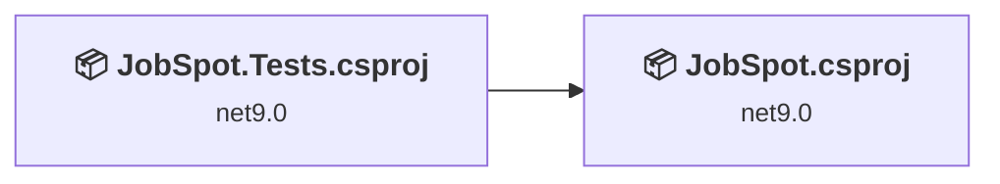
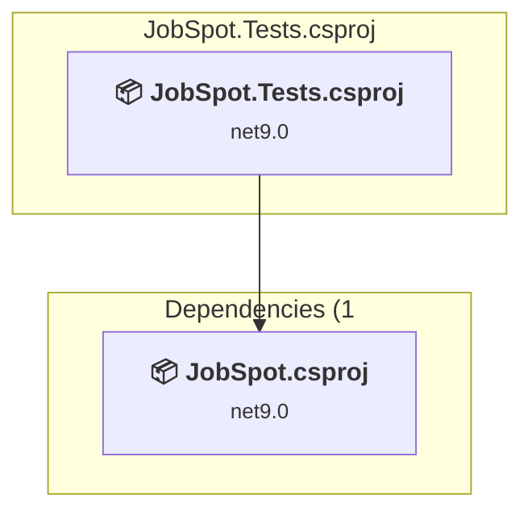
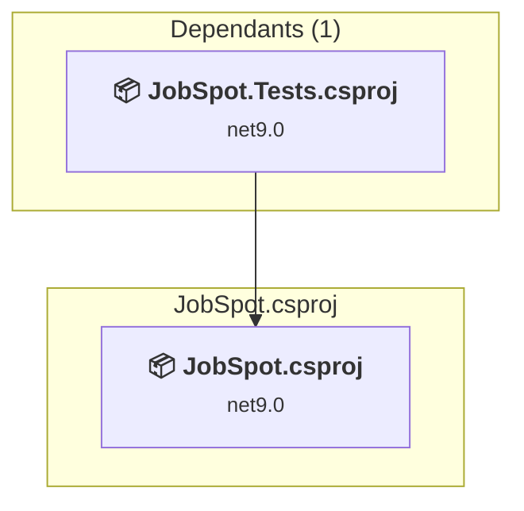

# Projects and dependencies analysis

This document provides a comprehensive overview of the projects and their dependencies in the context of upgrading to .NETCoreApp,Version=v10.0.

## Table of Contents

- [Executive Summary](#executive-Summary)
  - [Highlevel Metrics](#highlevel-metrics)
  - [Projects Compatibility](#projects-compatibility)
  - [Package Compatibility](#package-compatibility)
  - [API Compatibility](#api-compatibility)
  - [Binding Redirect Configuration](#binding-redirect-configuration)
- [Aggregate NuGet packages details](#aggregate-nuget-packages-details)
- [Top API Migration Challenges](#top-api-migration-challenges)
  - [Technologies and Features](#technologies-and-features)
  - [Most Frequent API Issues](#most-frequent-api-issues)
- [Projects Relationship Graph](#projects-relationship-graph)
- [Project Details](#project-details)

  - [JobSpot.Repository.Tests\JobSpot.Tests.csproj](#jobspotrepositorytestsjobspottestscsproj)
  - [JobSpot\JobSpot.csproj](#jobspotjobspotcsproj)

## Executive Summary

### Highlevel Metrics

| Metric | Count | Status |
| :--- | :---: | :--- |
| Total Projects | 2 | All require upgrade |
| Total NuGet Packages | 15 | 8 need upgrade |
| Total Code Files | 58 |  |
| Total Code Files with Incidents | 3 |  |
| Total Lines of Code | 6199 |  |
| Total Number of Issues | 19 |  |
| Estimated LOC to modify | 7+ | at least 0,1% of codebase |

### Projects Compatibility

| Project | Target Framework | Difficulty | Package Issues | API Issues | Binding Issues | Est. LOC Impact | Description |
| :--- | :---: | :---: | :---: | :---: | :---: | :---: | :--- |
| [JobSpot.Repository.Tests\JobSpot.Tests.csproj](#jobspotrepositorytestsjobspottestscsproj) | net9.0 | 🟢 Low | 4 | 0 | 0 |  | DotNetCoreApp, Sdk Style = True |
| [JobSpot\JobSpot.csproj](#jobspotjobspotcsproj) | net9.0 | 🟢 Low | 6 | 7 | 0 | 7+ | AspNetCore, Sdk Style = True |

### Package Compatibility

| Status | Count | Percentage |
| :--- | :---: | :---: |
| ✅ Compatible | 7 | 46,7% |
| ⚠️ Incompatible | 1 | 6,7% |
| 🔄 Upgrade Recommended | 7 | 46,7% |
| ***Total NuGet Packages*** | ***15*** | ***100%*** |

### API Compatibility

| Category | Count | Impact |
| :--- | :---: | :--- |
| 🔴 Binary Incompatible | 0 | High - Require code changes |
| 🟡 Source Incompatible | 6 | Medium - Needs re-compilation and potential conflicting API error fixing |
| 🔵 Behavioral change | 1 | Low - Behavioral changes that may require testing at runtime |
| ✅ Compatible | 16671 |  |
| ***Total APIs Analyzed*** | ***16678*** |  |

## Aggregate NuGet packages details

| Package | Current Version | Suggested Version | Projects | Description |
| :--- | :---: | :---: | :--- | :--- |
| coverlet.collector | 6.0.2 |  | [JobSpot.Tests.csproj](#jobspotrepositorytestsjobspottestscsproj) | ✅Compatible |
| Microsoft.AspNetCore.Authentication.Google | 9.0.14 | 10.0.9 | [JobSpot.csproj](#jobspotjobspotcsproj) [JobSpot.Tests.csproj](#jobspotrepositorytestsjobspottestscsproj) | NuGet package upgrade is recommended |
| Microsoft.AspNetCore.Identity.EntityFrameworkCore | 9.0.10 | 10.0.9 | [JobSpot.csproj](#jobspotjobspotcsproj) | NuGet package upgrade is recommended |
| Microsoft.AspNetCore.Identity.UI | 9.0.10 | 10.0.9 | [JobSpot.csproj](#jobspotjobspotcsproj) | NuGet package upgrade is recommended |
| Microsoft.EntityFrameworkCore.InMemory | 9.0.11 | 10.0.9 | [JobSpot.Tests.csproj](#jobspotrepositorytestsjobspottestscsproj) | NuGet package upgrade is recommended |
| Microsoft.EntityFrameworkCore.SqlServer | 9.0.10 | 10.0.9 | [JobSpot.csproj](#jobspotjobspotcsproj) | NuGet package upgrade is recommended |
| Microsoft.EntityFrameworkCore.Tools | 9.0.10 | 10.0.9 | [JobSpot.csproj](#jobspotjobspotcsproj) [JobSpot.Tests.csproj](#jobspotrepositorytestsjobspottestscsproj) | NuGet package upgrade is recommended |
| Microsoft.NET.Test.Sdk | 17.12.0 |  | [JobSpot.Tests.csproj](#jobspotrepositorytestsjobspottestscsproj) | ✅Compatible |
| Microsoft.VisualStudio.Web.CodeGeneration.Design | 9.0.0 | 10.0.2 | [JobSpot.csproj](#jobspotjobspotcsproj) | NuGet package upgrade is recommended |
| Moq | 4.20.72 |  | [JobSpot.Tests.csproj](#jobspotrepositorytestsjobspottestscsproj) | ✅Compatible |
| Serilog | 4.3.0 |  | [JobSpot.csproj](#jobspotjobspotcsproj) | ✅Compatible |
| Serilog.AspNetCore | 10.0.0 |  | [JobSpot.csproj](#jobspotjobspotcsproj) | ✅Compatible |
| Serilog.Sinks.File | 7.0.0 |  | [JobSpot.csproj](#jobspotjobspotcsproj) | ✅Compatible |
| xunit | 2.9.2 |  | [JobSpot.Tests.csproj](#jobspotrepositorytestsjobspottestscsproj) | ⚠️NuGet package is deprecated |
| xunit.runner.visualstudio | 2.8.2 |  | [JobSpot.Tests.csproj](#jobspotrepositorytestsjobspottestscsproj) | ✅Compatible |

## Top API Migration Challenges

### Technologies and Features

| Technology | Issues | Percentage | Migration Path |
| :--- | :---: | :---: | :--- |

### Most Frequent API Issues

| API | Count | Percentage | Category |
| :--- | :---: | :---: | :--- |
| M:Microsoft.AspNetCore.Builder.ExceptionHandlerExtensions.UseExceptionHandler(Microsoft.AspNetCore.Builder.IApplicationBuilder,System.String) | 1 | 14,3% | Behavioral Change |
| T:Microsoft.Extensions.DependencyInjection.GoogleExtensions | 1 | 14,3% | Source Incompatible |
| M:Microsoft.Extensions.DependencyInjection.GoogleExtensions.AddGoogle(Microsoft.AspNetCore.Authentication.AuthenticationBuilder,System.String,System.Action{Microsoft.AspNetCore.Authentication.Google.GoogleOptions}) | 1 | 14,3% | Source Incompatible |
| T:Microsoft.Extensions.DependencyInjection.IdentityServiceCollectionUIExtensions | 1 | 14,3% | Source Incompatible |
| M:Microsoft.Extensions.DependencyInjection.IdentityServiceCollectionUIExtensions.AddDefaultIdentity''1(Microsoft.Extensions.DependencyInjection.IServiceCollection,System.Action{Microsoft.AspNetCore.Identity.IdentityOptions}) | 1 | 14,3% | Source Incompatible |
| T:Microsoft.Extensions.DependencyInjection.IdentityEntityFrameworkBuilderExtensions | 1 | 14,3% | Source Incompatible |
| M:Microsoft.Extensions.DependencyInjection.IdentityEntityFrameworkBuilderExtensions.AddEntityFrameworkStores''1(Microsoft.AspNetCore.Identity.IdentityBuilder) | 1 | 14,3% | Source Incompatible |

## Projects Relationship Graph

Legend:
📦 SDK-style project
⚙️ Classic project

## Project Details

### JobSpot.Repository.Tests\JobSpot.Tests.csproj

#### Project Info

- **Current Target Framework:** net9.0
- **Proposed Target Framework:** net10.0
- **SDK-style**: True
- **Project Kind:** DotNetCoreApp
- **Dependencies**: 1
- **Dependants**: 0
- **Number of Files**: 4
- **Number of Files with Incidents**: 1
- **Lines of Code**: 672
- **Estimated LOC to modify**: 0+ (at least 0,0% of the project)

#### Dependency Graph

Legend:
📦 SDK-style project
⚙️ Classic project

### API Compatibility

| Category | Count | Impact |
| :--- | :---: | :--- |
| 🔴 Binary Incompatible | 0 | High - Require code changes |
| 🟡 Source Incompatible | 0 | Medium - Needs re-compilation and potential conflicting API error fixing |
| 🔵 Behavioral change | 0 | Low - Behavioral changes that may require testing at runtime |
| ✅ Compatible | 1026 |  |
| ***Total APIs Analyzed*** | ***1026*** |  |

### JobSpot\JobSpot.csproj

#### Project Info

- **Current Target Framework:** net9.0
- **Proposed Target Framework:** net10.0
- **SDK-style**: True
- **Project Kind:** AspNetCore
- **Dependencies**: 0
- **Dependants**: 1
- **Number of Files**: 62
- **Number of Files with Incidents**: 2
- **Lines of Code**: 5527
- **Estimated LOC to modify**: 7+ (at least 0,1% of the project)

#### Dependency Graph

Legend:
📦 SDK-style project
⚙️ Classic project

### API Compatibility

| Category | Count | Impact |
| :--- | :---: | :--- |
| 🔴 Binary Incompatible | 0 | High - Require code changes |
| 🟡 Source Incompatible | 6 | Medium - Needs re-compilation and potential conflicting API error fixing |
| 🔵 Behavioral change | 1 | Low - Behavioral changes that may require testing at runtime |
| ✅ Compatible | 15645 |  |
| ***Total APIs Analyzed*** | ***15652*** |  |

